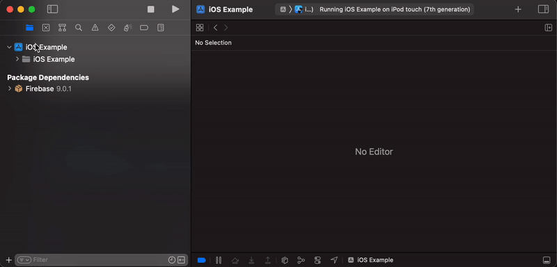

# Firebase xcframework integration with SPM

A small mirror for https://github.com/firebase/firebase-ios-sdk, to add support for using their binary dependencies (xcframeworks) with swift package manager. 

This repo contains a [Package.swift](https://github.com/akaffenberger/firebase-ios-sdk-xcframeworks/blob/master/Package.swift) file, which uses a `binaryTarget` for all Firebase libraries (xcframework files are hosted in github [releases](https://github.com/akaffenberger/firebase-ios-sdk-xcframeworks/releases)). 

## Official SPM Support

Firebase currently supports SPM integration, see the [official SDK integration instructions](https://github.com/firebase/firebase-ios-sdk#installation). This repo is an alternative for integrating with their pre-built xcframeworks for faster build times. See in depth discussion for official SPM support for xcframeworks [here](https://github.com/firebase/firebase-ios-sdk/issues/6564).

# Installation
- Add the package: 
    ```
    // swift-tools-version:5.3
    // The swift-tools-version declares the minimum version of Swift required to build this package.

    import PackageDescription

    let package = Package(
        name: "MyLibrary",
        platforms: [.iOS(.v11)],
        products: [
            .library(name: "MyLibrary", targets: ["MyLibraryTarget"])
        ],
        dependencies: [
            .package(
                name: "Firebase",
                url: "https://github.com/akaffenberger/firebase-ios-sdk-xcframeworks.git",
                .exact("8.10.0")
            ),
        ],
        targets: [
            .target(
                name: "MyLibraryTarget",
                dependencies: [
                    .product(name: "Google-Mobile-Ads-SDK", package: "Firebase"),
                    .product(name: "FirebaseAnalytics", package: "Firebase")
                ]
            )
        ]
    )
    ```

- Add `-ObjC` to Build Settings -> Other Linker Flags
- Some Firebase frameworks require resource bundles. Drag and drop the ones you need into your target's Copy Bundle Resources Phase:

  
